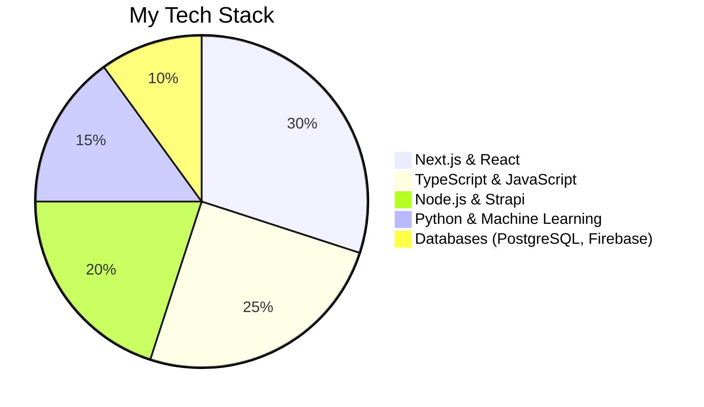

# Hi there, I'm Berina Spirjan 

---

### 🚀 About Me
🔹 **Full-Stack Developer** with experience in **React.js, Next.js, Node.js, TypeScript, Strapi, PostgreSQL, Firebase, AWS**  
🔹 **AI & Machine Learning Enthusiast** – working with **Python, TensorFlow, Alan.AI**  
🔹 **Passionate about building scalable & maintainable applications** 🚀  
🔹 **Mentoring developers and leading projects**  

💡 *"Great software is built by great teams and clean code."* ✨

---

### 🛠 Tech Stack

---

### 🔥 Technologies I Use

---

### 📊 GitHub Stats

### 🌍 Let's Connect

---

### 👩‍💻 Programmer's Life

